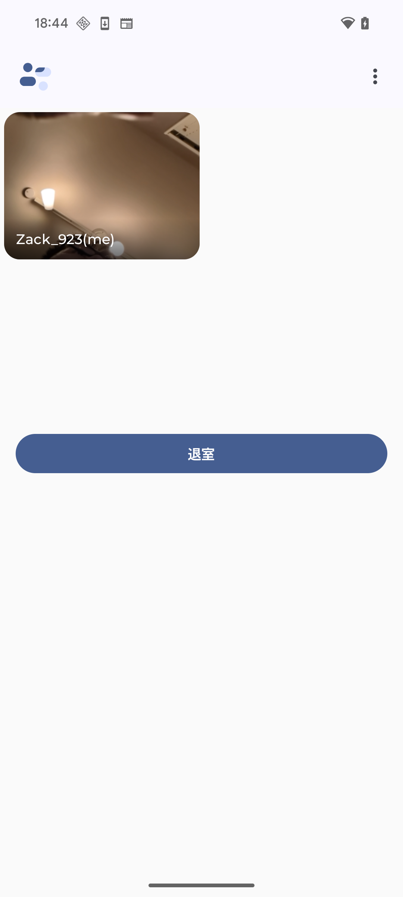
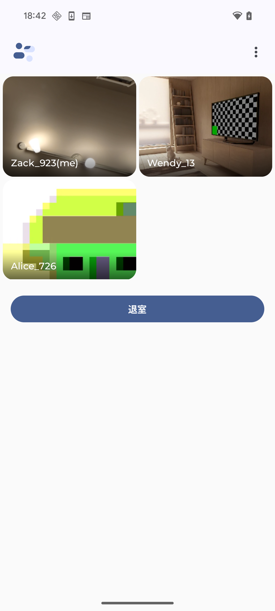

# 概要
Android公式サンプルアプリ [JetChat](https://github.com/android/compose-samples/tree/main/Jetchat) をベースに SkyWay Android SDKを導入し、以下のビデオチャット機能を実現する

| 1. ビデオチャットボタンを押す | 2. 自分が入室され、映像と音声の配信が開始 | 3. 他のメンバーが入室、自動的に相手の映像と音声の受信が開始 |
| -- | -- | -- |
|  |  |  | 


# ビデオチャット機能を実装する
[JetChat](https://github.com/android/compose-samples/tree/main/Jetchat)とのコード差分は[こちら](https://github.com/Jin-NeVen/SkyWayJetChat/compare/d7de556...main)

## SkyWay Android SDKの導入
- libs.versions.toml
- app/build.gradle.kts

## Permissionの追加
- AndroidManifest.xml
- CheckPermissionsUseCase
- NavActivity

## SkyWay Android SDKの初期化
- VideoChatViewModel.initializeSkyWay

## ビデオチャットRoomを作る
- VideoChatViewModel.createRoom

## ビデオチャットRoomに入室する
- VideoChatViewModel.createMemberMeAndJoinChatRoom

## ビデオチャットRoomで自分の映像と音声の配信
- VideoChatViewModel.captureMyVideoSteam
- VideoChatViewModel.captureMyAudioStream
- VideoChatViewModel.publishMyAVStream

## ビデオチャットRoomで他部ループメンバーの映像音声の受信
- VideoChatViewModel.subscribeRoomMembersAVStream

## 退室
- VideoChatViewModel.leaveChatRoom

## NOTICE
本サンプルアプリは、一応Android App Architectureに従って作ったつもりですが、便宜上一部のコードはBest Practiceに沿って実装されない場合がございます。

# License
```
Copyright 2025 Jin

Licensed under the Apache License, Version 2.0 (the "License");
you may not use this file except in compliance with the License.
You may obtain a copy of the License at

    https://www.apache.org/licenses/LICENSE-2.0

Unless required by applicable law or agreed to in writing, software
distributed under the License is distributed on an "AS IS" BASIS,
WITHOUT WARRANTIES OR CONDITIONS OF ANY KIND, either express or implied.
See the License for the specific language governing permissions and
limitations under the License.
```